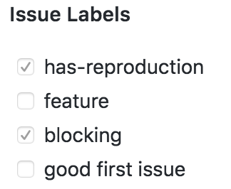

# apollo-bot

A helpful community bot for Apollo that focuses on enabling contribution. Currently, Apollo Bot is setup on all Apollo repositories to allow users to add labels to issues and PRs with a `/label` command.

## Usage

When openning issues or a pull request, the body is parsed by Apollo Bot to determine if a label command or checkbox next to a predefined label is activated.

### Checkboxes

For a preset check box, the templates include has-reproduction, feature, blocking, and good first issue(or review). To label your request, simply put an x in the box, like so [x]. The below example would cause the has-reproduction and blocking labels to be added:

```
**Issue Labels**

- [x] has-reproduction
- [ ] feature
- [x] blocking
- [ ] good first issue
```



> Note: These check boxes are whitelisted, so if you want to use other labels, you must use a `/label` command.
>
> Additionally if you do want these checkboxes to stay hidden, then include a comment around them \<!-- -->

### / Commands

Currently, Apollo Bot supports the `/label` command. To use it in a comment of an issue or pull request, include it on it's own line with the desired label following it. This is an example of a good comment that would add the `has-reproduction` and `apollo-link-http` labels:

```
Here is a code sandbox reproduction: https://codesandbox.io/s/v69v13w0o0

/label has-reproduction
/label apollo-link-http

Thanks for reading my issue comment!
```

